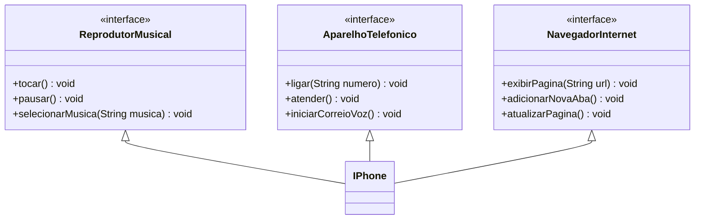

# PROJETO IPHONE 2007
#### Autor: [Larissa Menezes](https://github.com/lari0515/)
#### &nbsp;
### DESCRIÇÃO
---

#### Este projeto tem como objetivo modelar e diagramar a representação UML do componente iPhone, abrangendo suas funcionalidades como Reprodutor Musical, Aparelho Telefônico e Navegador na Internet, conforme o lançamento do iPhone em 2007.
### &nbsp;

### DIAGRAMA DE CLASSE
---
#### &nbsp;
